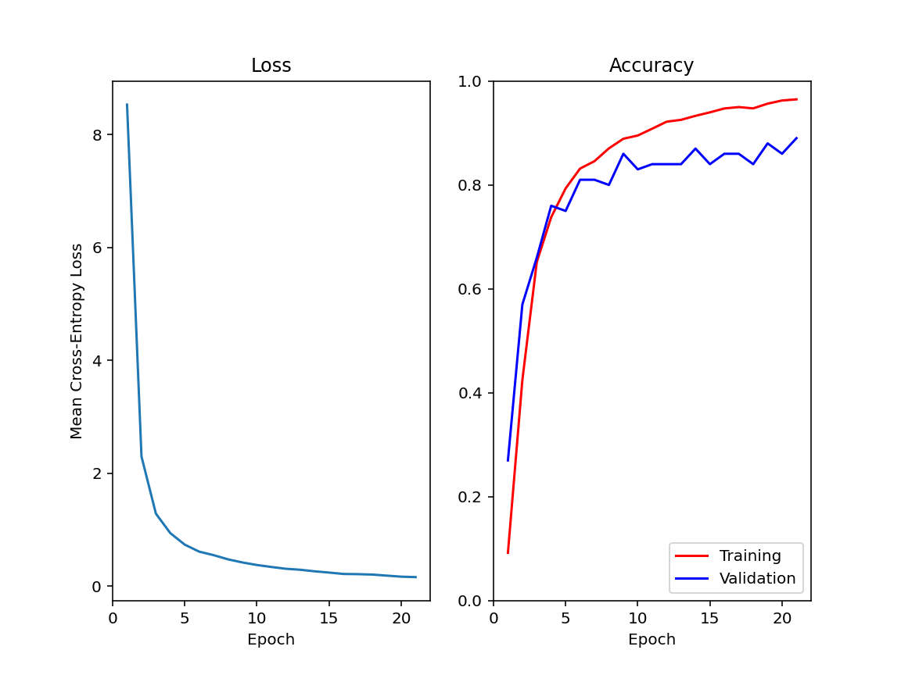

# Flax CNN

I fine-tuned a pre-trained VGG-19 (Flax NNX) to classify 75 butterfly species, replacing the final classifier layer with a 75-way head and freezing the convolutional backbone so only the classifier trains.

---

## Table of Contents

- [Overview](#overview)
- [The Dataset](#the-dataset)
- [Background: CNNs](#background-cnns)
- [Background: Transfer Learning & VGG19](#background-transfer-learning--vgg19)
- [train.py](#trainpy)
- [predict.py](#predictpy)
- [Results](#results)
- [What I Learned](#what-i-learned)

---

## Overview

Rather than training a CNN from scratch, this project applies transfer learning: a VGG19 model pre-trained on ImageNet is downloaded from HuggingFace, and its final classifier layer is replaced with a new linear layer sized to the butterfly categories, and only the classifier parameters are trained. The convolutional backbone stays frozen. Training uses the AdamW optimizer with softmax cross-entropy loss, tracking accuracy and average loss per epoch on both the training and validation splits.

The following links were very useful in completing this assignment and learning more about the necessary libraries:

- [API Reference — JAX documentation](https://docs.jax.dev/en/latest/jax.html)
- [flax.nnx](https://flax.readthedocs.io/en/latest/api_reference/flax.nnx/index.html)
- [Metrics](https://flax.readthedocs.io/en/stable/api_reference/flax.nnx/training/metrics.html#)
- [Filters](https://flax.readthedocs.io/en/latest/guides/filters_guide.html)
- [Losses — Optax documentation](https://optax.readthedocs.io/en/latest/api/losses.html#)

---

## The Dataset

In this project directory, there are three directories that are filled with photos of butterflies: train, validate, and test. There is a CSV file for each directory. Testing_set.csv and Validation_set.csv include the name of each file and the type of butterfly.

The standard VGG19 Model expects a 224 x 224 color image.

---

## Background: CNNs

A key difficulty in modern machine learning is that the input dimension can be very large. Images are a great example. If an image has height H and width W and is stored with three RGB channels, then the raw input dimension is:

```math
D = H \cdot W \cdot 3
```

Even for moderately sized images, $`D`$ can reach the millions. A deeper issue is that the pixels are not independent features. Nearby pixels are strongly correlated, and local neighborhoods tend to form meaningful patterns such as edges, corners, and textures. Treating each pixel as an unrelated coordinate ignores the spatial structure of these images.

Convolutional Neural Networks (CNNs) address these issues by building in two key elements. First is *locality*. Features are learned from small spatial neighborhoods rather than the entire image at once. The second is *weight sharing*, which means that the same feature detector is applied across different spatial locations so that knowledge learned in one region is immediately reusable elsewhere. Together, these biases reduce the number of parameters dramatically and align the architecture with the geometry of images.

### Architecture

In deep learning, convolution is viewed as a sliding dot product. We choose a small set of learnable weights, called a filter or a kernel, and move it across the input. At each position, we multiply the filter with the local input patch entry-by-entry and sum, which outputs one value. Repeating this over all locations creates an output array called a feature map.

A standard CNN for classification looks like:

```math
\text{input} \to \text{repeated convolution and nonlinearity} \to \text{occasional pooling} \to \text{flatten} \to \text{fully-connected layers} \to \text{softmax}
```

### Zero Padding

Without padding, the output shrinks because the kernel cannot be placed so that it overlaps the boundary while still remaining entirely inside the input. Zero padding fixes this by enlarging the input with a border of zeros before applying convolution.

### Max Pooling

To reduce spatial resolution and make representations less sensitive to small translations, CNNs often use pooling operations. If the input shifts, the feature map shifts with it. This is useful for detecting patterns anywhere in the image, but it also means that the convolution remains position sensitive.

Pooling addresses this by summarizing a local neighborhood with a single value. The idea is to keep the most salient signal in each region while reducing spatial resolution. Max pooling implements this by taking the maximum value in each window.

### Stride

Pooling is not the only way to reduce spatial resolution. A common alternative is to downsample by using a stride in a convolutional layer. With stride $`S > 1`$, the kernel moves by $`S`$ pixels each step rather than by one pixel, which reduces the number of kernel placements, so the output has smaller spatial dimensions, while the operation remains a convolution with learned weights.

---

## Background: Transfer Learning & VGG19

Training a large CNN from scratch is expensive and requires massive datasets. Fortunately, many pre-trained models are publicly available and ready to reuse.

The key insight is that early layers learn the universal features — edges, textures, contours — that are useful across many tasks. Later layers, by contrast, encode the task-specific abstractions that need to be adapted.

Transfer learning exploits this by:

1. Taking a network pre-trained on a large dataset (e.g., ImageNet)
2. Freezing the early layers, whose weights are left unchanged
3. Fine-tuning the later layers (or adding new task-specific layers) on a smaller, task-specific dataset

In practice, only the parameters of the layers that we wish to update are passed to the optimizer.

VGG19 is the pre-trained model that we use for this project. It is a 19-weight-layer CNN that has 16 conv layers and ends with a flatten and three fully-connected layers. It is around 143M parameters, with most of them being in those FC layers. It is a backbone for transfer-learning because its conv features are generic and its structure is extremely simple.

The deviation from standard VGG19 to my project is the classifier. Instead of flatten + three Linear layers, it is the convolutionalized FC formulation:

```math
7 \times 7 \text{ conv} \to 1 \times 1 \text{ conv} \to \text{mean pool} \to \text{Linear(4096, 1000)}
```

---

## train.py

This program uses the VGG19 model and the training data to create, train and save a model. As it does this, it uses the validation data to ensure that the model is generalizing to a point where it is effective on data it has not been trained on.

We start off with replacing the last classifier layer of the model with the correct number of output features. We need to split the model into the graph structure definition and the abstract state, because the model object contains both. All we care about is the state, as we already have the static graph structure.

Once we have cached the state, we merge graph_def and state back into model for use. This is done using nnx.merge() and nnx.split().

Then, we create a filter so that we only optimize the classifier segment of the VGG19 without modifying any other pre-trained values, which is a key principle of transfer learning. nnx.All() is very useful here:

```python
classifier_params = nnx.All(nnx.Params, nnx.PathContains('classifier'))
```

nnx.All() basically performs an and operation between nnx.Params and nnx.PathContains('classifier'). In simple terms, the filter is basically parameters, and items that are contained in 'classifier'. If we combine these, this just becomes the trainable parameters in the classifier segment of the model, as intended.

We then create an optimizer for these parameters that are being trained. I used the Optax adamw update function, with learning rate $`1.0 \times 10^{-5}`$. This was done with nnx.Optimizer. I then used nnx.MultiMetric to track accuracy and average loss.

This is all we need for our loss function, training step, and evaluation step.

### Loss Function

We can start off with the loss function. Here, we perform a forward pass to calculate the resulting logits. Then, we find the loss as the mean cross-entropy loss with softmax based on integer labels. optax.softmax_cross_entropy_with_integer_labels() was very useful here. That is all. Simply return the loss and logits.

### Training Step

Next is the training step function. We need to form a gradient function such that it returns both the loss/logit values of the loss function and the respective gradients. The standard choice here is nnx.value_and_grad(). The only problem is that this would differentiate with respect to all parameters in the model, but we froze the backbone. DiffState is how we tell the gradient function about this freeze:

```python
diff_state = nnx.DiffState(0, classifier_params)
```

This is basically read as: for the model (arg 0), treat only the parameters that match classifier_params as differentiable variables, everything else constant.

We can then call the gradient function to grab the loss, logits, and gradients. We can update the metrics with these and close the loop by updating the optimizer with the model and gradients.

### Validation Step

Finally, the function to validate the steps. This is fairly simple. We call our loss function to grab the loss and the logits and update our metrics.

### Learning Loop

Now that we have these functions, we can start our learning loop. We start off by putting the model in training mode with model.train(). Then, we take one training step for the inputs in our training dataloader using the train_step() function we just built. Once this is done, we compute the metrics using metrics.compute() and finally record them.

Now, we reset the metrics for the test step and put the model into eval mode using model.eval(). We get a new shuffling of the validation dataloader and take an evaluation step per input in the dataloader using the eval_step() function. Compute and record the metrics once again.

This is all. We end off with just saving the trained model.

---

## predict.py

The test directory has unlabeled images. In this program, the trained model will try to guess what species is in each photo.

We start off with grabbing the model (making sure to replace the last layer of the classifier) and putting it into eval mode. Instead of batches, we process the images one at a time. First, I use pillow to load the image. Then, I use the transform function from ImageDataset.py, that resizes, crops, and normalizes it. This is needed because inference preprocessing must match training preprocessing exactly.

We then need to add a new axis at position 0 of the image, to make it a batch of 1, because the model is built for batches. jnp.expand_dims() was useful here. Now that this is out of the way, we just do model inference, get the hard prediction using argmax(), and grab the category label corresponding to the prediction.

---

## Results

Training for 21 epochs on an H100 reached 89.0% validation accuracy, with 96.5% training accuracy and a final mean training loss of 0.157.



The curves show the classic transfer learning pattern. The first epoch shows a dramatic improvement because the pre-trained ImageNet backbone already produces meaningful features, only the new classifier head needs to learn.

---

## What I Learned

**A model is structure plus state, and they live in different places.** The biggest conceptual unlock in this project was understanding why nnx.split() and nnx.merge() exist. The graph structure is already written down in the source code, so the only thing worth saving to disk is the state — the arrays. Checkpointing is just persisting the expensive half of the model and rebuilding the free half from code. The same split/merge idea is also what lets JAX transforms like jit work on models at all, since they only understand pytrees of arrays.

**Freezing is enforced in two places, and they must agree.** Transfer learning here is not one switch. The same filter (nnx.All(nnx.Params, nnx.PathContains('classifier'))) has to be given both to the gradient function (via DiffState, controlling which gradients get computed) and to the optimizer (via wrt, controlling which parameters get updated). A bonus insight: because the frozen layers come before the trainable ones, backpropagation stops at the classifier input and never touches the backbone, which makes training much cheaper than full fine-tuning.

**Inference preprocessing must match training preprocessing exactly.** The model learned on images resized to 224 x 224 and normalized with ImageNet statistics, so predict.py imports the same transform function that training used. This includes normalizing with ImageNet's mean and std rather than the butterfly data's own, because the pre-trained weights expect inputs distributed the way they saw during their original training.

**Small bugs hide in the boring parts.** The bugs in this project were not in the ML: a shadowed Python builtin (input instead of inputs), a variable that only existed on one branch of an if/else, and a pickle call missing its file argument that would have crashed after 21 epochs of training. On a cluster, that last kind of bug is expensive — anything that runs after hours of compute deserves the most scrutiny, not the least.

**Cluster jobs need slack.** The Slurm walltime has to cover environment setup, downloads, and training, and since the model only saves at the very end, hitting the limit at epoch 20 loses everything. Production loops checkpoint every few epochs for exactly this reason.
