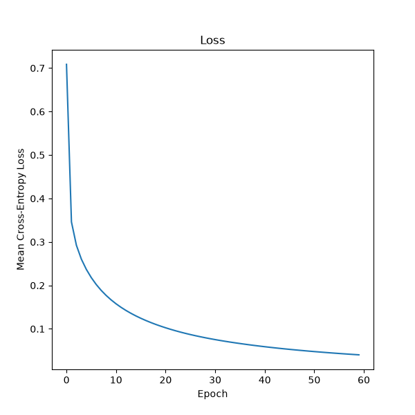

# I built and trained a neural network completely from scratch using JAX arrays and manual backpropagation. Then, I trained the same network using Flax NNX, a modern JAX neural network library.

---

## Table of Contents

- [Overview](#overview)
- [The Dataset](#the-dataset)
- [Background: How Neural Nets Work](#background-how-neural-nets-work)
- [Part 1: Initializing and The Forward Pass](#part-1-initializing-and-the-forward-pass)
- [Background: Backpropagation](#background-backpropagation)
- [Part 2: Backpropagation](#part-2-backpropagation)
- [Part 3: Flax NNX Implementation](#part-3-flax-nnx-implementation)
- [Results](#results)
- [What I Learned](#what-i-learned)

---

## Overview

This will be a super long README. I will be jumping around from file to file because of the various layers of the neural net. By the end, we will have trained and tested a two-layer neural network on the MNIST dataset, in which we should be able to predict what number was given based on a handwritten digit.

Most of the files are helper classes; the actual implementation is done in `train_scratch.py` and `train_nnx.py`.

There are two fully connected layers in this network:

- The first ("fc1") takes in an input matrix (n x 784) and outputs a (n x 128) matrix.
- The second ("fc2") takes in the hidden layer (n x 128) and outputs a (n x 10) matrix.

---

## The Dataset

The MNIST is a collection of 28 x 28 black and white images of handwritten digits. Everybody writes their first neural network to categorize these images. The training set is 60,000 images, and the testing set is another 10,000 images. Each pixel is one unsigned byte. Therefore, 0 means paper, and 255 means full ink.

The `X_train_int` array will be a 60,000 x 784 JAX array of numbers between 0 and 255. `y_train` will be a JAX array of 60,000 labels, numbers between 0 and 9.

---

## Background: How Neural Nets Work

Linear regression has one key limitation: it is *linear*. Any continuous function can be approximated by a polynomial of sufficiently high degree, so high-degree polynomials are expressive enough. More importantly, we do not need to write a high-degree polynomial all at once, we can compose many low-degree pieces, as compositions of simple functions can produce arbitrarily complex ones.

This is the core idea behind neural networks. Each layer computes an intermediate representation and passes it forward. The deeper the network, the higher the effective polynomial degree it can represent, and the more complex functions it can learn.

We will use a fully connected layer, where every neuron in the current layer connects to every single neuron in the previous layer.

### Activation Functions

There is one issue: stacking linear functions gives us a linear function. Therefore, we need every intermediate transformation to be *nonlinear*. These transformations are called activation functions.

#### Sigmoid

$$
\sigma(x) = \frac{1}{1 + e^{-x}}
$$

A smooth S-shaped curve that maps any real number to $(0,1)$

#### ReLU (Rectified Linear Unit)

$$
\text{relu}(x) = \text{max}(0, x)
$$

This is what we will be using in our neural net. It clips any negative value to zero, and passes positive values unchanged.

#### Leaky ReLU

$$
\operatorname{LeakyReLU}(x) = \max(\alpha x, x), \quad \text{where } \alpha > 0 \text{ is small.}
$$

Like ReLU, but allows for a negative slope for $x < 0$ to avoid dead neurons.

#### Tanh

$$
\tanh(x) = \frac{e^x - e^{-x}}{e^x + e^{-x}}
$$

Similar shape to sigmoid, but outputs in $(-1, 1)$

#### Swish

$$
\operatorname{Swish}(x) = x\sigma(x)
$$

There are many other activation functions, but these are the main ones. There are three main properties that are needed for a good activation function:

1. Nonlinear: essential for expressive power
2. Differentiable: so that gradients can flow through the network during backpropagation
3. Computationally tractable: the function and its derivative must be cheap to evaluate

### Neurons

Each neuron computes exactly:

$$
a_j = \sigma\left(b_j + w_{1,j} x_1 + w_{2,j} x_2 \right)
$$

where in this case, we are using the sigmoid activation function. The bias $b$ lets the neuron shift its activation threshold, and the weights control how much the input influences that neuron.

### Loss Functions

Like linear regression, we use a loss function to penalize our network's mistakes. For classification, the standard choice is often **mean cross-entropy loss:**

$$
L(\hat{Y}, Y) = -\frac{1}{n}\sum_{i=1}^{n}\sum_{k=1}^{10} y_{i,k} \log(\hat{y}_{i,k})
$$

This loss function heavily penalizes confidently wrong predictions because of the logarithm, and assigns small loss to confident correct predictions, which leads to well-behaved gradients.

We often pair this with softmax. Softmax allows us to turn the outputs from the network into probabilities. Instead of hard classification like taking the max (and argmax), we can exponentiate the scores and normalize so the outputs sum to 1:

$$
\operatorname{softmax}(z)_i = \frac{e^{z_i}}{\sum_{j=1}^{k} e^{z_j}}
$$

So, for each input, we compute a score for every class, and apply softmax to turn the scores into probabilities. We then compare with a one-hot label, and use cross-entropy as the loss.

---

## Part 1: Initializing and The Forward Pass

### FullyConnected.py

The fully connected layer has a weights matrix and a bias vector. We initialize the bias vector to be all zeros, and initialize the weights matrix using the He method.

The He method is: if the layer has $m$ inputs, the weights should be randomly chosen from a normal distribution with a mean of 0 and a standard deviation of $\sqrt{2/m}$.

We use `randkey.py` to generate and return a new JAX random key. (Note: JAX randomness is functional, so we split the current key into new global and subkey for our use)

Now, we just sample from a normal distribution using:

```python
jax.random.normal(randkey.newkey(), shape=(input, output)) * jnp.sqrt(2/input)
```

Now, we need to implement the forward operation. This takes the input and generates an output. As stated earlier, the forward operation is simply:

$$
Z^{(1)} = XW^{(1)} + \mathbf{1}\left(b^{(1)}\right)^\top
$$

### Relu.py

We will have one ReLU layer. It will take in the n x 128 JAX array from "fc1" and apply the rectified linear operation to it. So, we just apply the ReLU to the input, store any information needed to compute the gradients later, and return the result. From earlier, ReLU is just $\text{max}(0,x)$.

### Softmax.py

Here, we implement softmax with a max-subtraction trick:

$$
s_j = e^{x_j - c}
$$

where:

$$
c = \max_j x_j
$$

We need to make sure that we are summing along the class axis (axis = 1), but making sure that axis is not dropped entirely (keepdims) so that the shapes line up for broadcasting.

### CrossEntropy.py

Here, we are just computing the mean cross-entropy loss. Remember, for a single example this is just:

$$
L(\hat{y}, y) = -\sum_{k=1}^{10} y_k \log(\hat{y}_k)
$$

and we average this over all $n$ examples in the batch.

### train_scratch.py

All of our helper classes and functions are complete for the initialization and forward pass phases.

One thing remaining is that we have not converted our soft prediction back into a hard one. We can do this by taking the argmax of the probabilities, and returning whether pred == labels:

```python
def compute_accuracy(proba, labels):
	pred = jnp.argmax(proba, axis=1)
	return jnp.mean(pred == labels)
```

---

## Background: Backpropagation

We now have multiple layers, each with its own parameters $W, b$. To apply gradient descent, we need a chain rule across layers.

We use backpropagation to compute how the loss changes with respect to every parameter in this network. Using the chain rule of calculus, the gradient of the loss is propagated backward from the output layer through all preceding layers. Each layer is responsible for calculating its own partial derivatives, allowing the network to update its weights and biases to minimize the loss during training.

The key insight here is that each layer receives a gradient from above, uses it to update its own parameters, and then passes a modified gradient downstream.

### Step 1: Gradient at the output

With labels $y \in \mathbb{R}^{n \times 10}$, and mean cross-entropy loss, the gradient at the output follows from the softmax + cross-entropy derivation:

$$
\nabla_{Z^{(3)}} L = \frac{1}{n}(\hat{Y} - Y)
$$

### Step 2: Gradients for the last linear layer

For $Z = XW + \mathbf{1}b^\top$, we need two kinds of gradients:

1. Parameter gradients to update the layer's own weights and biases:

$$
\nabla_{W}L = X^T \nabla_Z L
$$

$$
\nabla_b L = (1^T\nabla_Z L)^T
$$

2. Input gradient to continue the relay to the layer below:

$$
\nabla_X L = \nabla_Z L \, W^T
$$

### Step 3: Backprop through ReLU

The ReLU gate introduces an element-wise derivative that is $1$ when $Z > 0$ and $0$ otherwise. Multiplying the upstream gradient by this binary mask gives the gradient passed to the layer below

### Step 4: Gradients for the first linear layer

Perform the same linear-layer rules that we did for the last linear layer.

---

## Part 2: Backpropagation

My backpropagation work is divided across multiple files. Together, they form the full backpropagation pipeline and allow the network to learn from its prediction errors and progressively improve accuracy.

### train_scratch.py

In this file, I implemented the gradient of softmax/cross-entropy.

The softmax function has 10 inputs, $c_1, c_2, \dots, c_{10}$ that result in $\hat{y_1}, \hat{y_2}, \dots, \hat{y_{10}}$ that are fed into the cross-entropy loss and one number emerges. From earlier, this partial is just:

$$
\nabla_{Z^{(3)}} L = \frac{1}{n}(\hat{Y} - Y)
$$

### FullyConnected.py

The next layer up is "fc2". We just found the gradient of the loss in terms of the output.

The output from the weights_gradient will be added to the weights array, so they have to have the same shape. Similarly, the output from the biases_gradient will be added to the biases vector, so they have the same shape. The output from input_gradients will have the same shape as the input array $B$ because we are computing the gradient of the loss function at every point.

We already have the formula for input_gradients and weights_gradient. Because $b$ appears in every row of Z, the chain rule sums over all n examples. I was tempted to use the mean, but dL is already averaged.

### Relu.py

The next layer up is the ReLU activation layer. This activation function has no parameters, so we only need to worry about input_gradients. The Jacobian in this case is easy: if the input is positive, the partial derivative is 1. If the input was negative, the partial derivative was 0.

### train_scratch.py

We have now fully built all the classes and functions for the forward and backward passes. We just need to string these together to make the backpropagation happen, and we'll be done!

It is simply:

```python
dL_dc = (y_hat - batch_y) / len(y_hat)
grad_fc2_w = layers["fc2"].weights_gradient(dL_dc)
grad_fc2_b = layers["fc2"].biases_gradient(dL_dc)
dL_db = layers["fc2"].input_gradients(dL_dc)
dL_da = layers["act1"].input_gradients(dL_db)
grad_fc1_w = layers["fc1"].weights_gradient(dL_da)
grad_fc1_b = layers["fc1"].biases_gradient(dL_da)
```

Then, we just update our parameters:

```python
params = {
	"fc1": {"W": layers["fc1"].weights - LEARNING_RATE * grad_fc1_w, "b": layers["fc1"].biases - LEARNING_RATE * grad_fc1_b},
	"fc2": {"W": layers["fc2"].weights - LEARNING_RATE * grad_fc2_w, "b": layers["fc2"].biases - LEARNING_RATE * grad_fc2_b},
}
```

I found a learning rate that gives me over $96\%$ accuracy on the testing data.

---

## Part 3: Flax NNX Implementation

I have officially implemented a neural network from scratch by creating layers, implementing forward propagation, backpropagation, computing gradients, updating parameters, and saving and reloading weights.

Now, for this part, I will repeat the same process using Flax NNX. My goal is to explore how JAX-based NN libraries look.

### MNISTModel.py

This is the neural network architecture using nnx.Module. The model has a fully connected layer $784 \to 128$, a ReLU activation, and a fully connected layer from $128 \to 10$.

### train_nnx.py

We first need to create the model and the optimizer.

The optimizer object knows how to update the parameters of our model using the AdamW optimization algorithm. It is found in the Optax library used with JAX. We can see it by:

```python
optimizer = nnx.Optimizer(model, optax.adamw(LEARNING_RATE, MOMENTUM), wrt=nnx.Param)
```

Breaking this down:

1. model $\to$ MNISTModel.py
2. optax.adamw(LEARNING_RATE, MOMENTUM)

	This creates the AdamW update rule:

$$
\theta_{t+1} = \theta_t - \alpha \frac{\hat{m}_t}{\sqrt{\hat{v}_t} + \epsilon} - \alpha \lambda \theta_t
$$

	where:
	- $\theta$ = weights
	- $\alpha$ = learning rate
	- $m$ = first momentum estimate
	- $v$ = second momentum estimate
	- $\lambda$ = weight decay

	(Note: the second positional argument to optax.adamw is actually Adam's $\beta_1$, the decay rate for the first moment estimate. I call it MOMENTUM since it plays the same role as classical momentum.)

3. wrt = nnx.Param - this just means to only optimize things that are parameters

Next, I perform the training loop 20 times. For each batch, I computed the gradients using JAX autodiff and updated the model parameters using the optimizer. nnx.value_and_grad is very useful because it gives us the loss and the gradients.

That is all. This implementation is much, much shorter than the neural net from scratch.

---

## Results

### train_scratch.py

After 60 epochs, my loss dropped smoothly from $0.7087$ to $0.0403$. My final training accuracy was $99.1\%$ and my testing accuracy was $97.7\%$, with a learning rate of $0.3$.

This loss drops cleanly, unlike the NNX run's minor noise



### train_nnx.py

After 20 epochs, the loss dropped steadily from $0.2587$ to $0.0268$. My final training accuracy was $99.36\%$ and testing accuracy was $97.41\%$, with a learning rate of $0.1$ and momentum of $0.9$.

This gap in the train/test $\%$ is normal mild overfitting for an MLP. The usual levers are adding dropout/weight decay or a convolutional layer.

---

## What I Learned

- **Backpropagation is just the chain rule, organized.** Writing weights_gradient, biases_gradient, and input_gradients by hand made it concrete: every layer receives an upstream gradient, updates its own parameters, and relays a modified gradient downstream. Nothing about it is magic once the matrix shapes line up.
- **Shapes are the whole game.** Almost every bug I hit came down to array shapes: knowing that $\nabla_W L$ must match $W$ (784 x 128), that the bias gradient sums over the batch axis, and that softmax needs `axis=1, keepdims=True` to broadcast correctly. Thinking shape-first made the vectorized code almost write itself.
- **Numerical stability matters in practice.** The max-subtraction trick in softmax is not optional. Exponentiating raw scores overflows. Theory-correct and computer-correct are different things.
- **Initialization and learning rate are not afterthoughts.** He initialization ($\sigma = \sqrt{2/m}$) paired with ReLU kept gradients healthy, and tuning the learning rate was the difference between diverging and hitting $97.7\%$ test accuracy.
- **Softmax + cross-entropy have a beautifully simple combined gradient.** Deriving $\frac{1}{n}(\hat{Y} - Y)$ by hand showed why this pairing is standard: the messy Jacobians cancel into one clean expression.
- **Libraries like Flax NNX earn their abstraction.** After building everything manually, the NNX version was a fraction of the code: autodiff replaced my hand-derived gradients and Optax's AdamW replaced my plain gradient descent update. But I only understand what `nnx.value_and_grad` and the optimizer are doing because I built the from-scratch version first.
